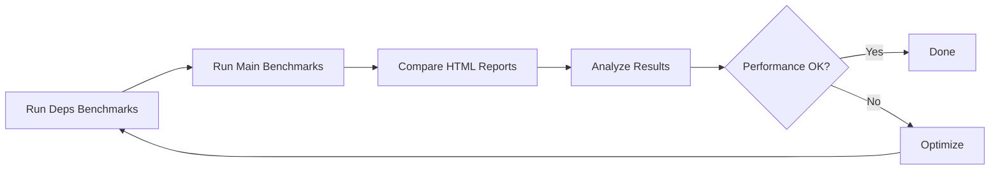

# Project Summary: bigweaver-agent-canary-zeta-hydro-deps

## Overview

This repository provides a comprehensive benchmarking suite for timely and differential-dataflow, enabling performance comparisons with Hydroflow implementations. It was created by separating timely/differential-dataflow benchmarks from the main Hydroflow repository to improve build times and maintain clean dependency separation.

## Quick Facts

- **Purpose**: Performance benchmarking for timely/differential-dataflow
- **Language**: Rust
- **Framework**: Criterion.rs
- **Benchmarks**: 8 comprehensive benchmarks
- **Dependencies**: timely-master 0.13.0-dev.1, differential-dataflow-master 0.13.0-dev.1
- **Related Repository**: bigweaver-agent-canary-hydro-zeta (Hydroflow)

## Repository Structure

```
bigweaver-agent-canary-zeta-hydro-deps/
├── Documentation
│   ├── README.md                           # Quick start and overview
│   ├── SETUP.md                           # Installation guide
│   ├── BENCHMARKS.md                      # Detailed benchmark docs
│   ├── CONTRIBUTING.md                    # Contribution guidelines
│   ├── BENCHMARKING_BEST_PRACTICES.md    # Best practices guide
│   ├── CHANGELOG.md                       # Version history
│   └── PROJECT_SUMMARY.md                 # This file
│
├── Build Configuration
│   ├── Cargo.toml                         # Workspace configuration
│   ├── Makefile                           # Build automation
│   └── .criterion.toml                    # Benchmark configuration
│
├── Benchmarks
│   └── benches/
│       ├── Cargo.toml                     # Benchmark dependencies
│       ├── README.md                      # Benchmark overview
│       └── benches/                       # Benchmark implementations
│           ├── arithmetic.rs              # 8 benchmark files
│           └── reachability_*.txt         # Test data
│
├── Scripts
│   ├── compare_benchmarks.sh             # Cross-repo comparison
│   └── check_performance.sh              # Regression detection
│
└── CI/CD
    └── .github/workflows/
        └── benchmarks.yml                 # GitHub Actions
```

## Key Features

### 1. Comprehensive Benchmark Suite

Eight benchmarks covering different aspects of dataflow systems:

| Category | Benchmarks | Description |
|----------|-----------|-------------|
| **Data Flow** | arithmetic, identity, upcase | Basic streaming patterns |
| **Graph Patterns** | fan_in, fan_out, fork_join | Complex dataflow graphs |
| **Relational** | join | Database-style operations |
| **Incremental** | reachability | Differential dataflow features |

### 2. Multiple Implementations

Each benchmark includes:
- **Timely/Differential**: Framework implementations
- **Baselines**: Raw/iter/pipeline for comparison
- **Documentation**: Purpose, configuration, interpretation

### 3. Performance Comparison Tools

- **compare_benchmarks.sh**: Interactive cross-repository comparison
- **check_performance.sh**: Automated regression detection
- **Makefile**: Convenient command shortcuts
- **CI/CD**: Automated benchmark runs on PRs

### 4. Comprehensive Documentation

- **Setup guide**: Installation and configuration
- **Benchmark details**: In-depth explanation of each benchmark
- **Best practices**: How to write and run benchmarks reliably
- **Contributing guide**: How to add new benchmarks

### 5. Development Tools

- **Makefile**: 30+ commands for common tasks
- **CI/CD**: Automated testing and benchmarking
- **Scripts**: Comparison and regression detection
- **Configuration**: Criterion.rs tuning

## Getting Started

### Quick Start (3 minutes)

```bash
# 1. Clone and build
git clone <repo-url>
cd bigweaver-agent-canary-zeta-hydro-deps
cargo build

# 2. Run a quick benchmark
cargo bench --bench arithmetic

# 3. View results
open target/criterion/report/index.html
```

### Full Setup (10 minutes)

See [SETUP.md](SETUP.md) for comprehensive installation and configuration.

## Common Use Cases

### Use Case 1: Quick Performance Check

```bash
# Fast benchmark run for development
make bench-quick
```

**When**: During development to check for obvious regressions
**Time**: ~2-5 minutes
**Accuracy**: Lower (fewer samples)

### Use Case 2: Accurate Performance Measurement

```bash
# Full benchmark suite
make bench
```

**When**: Before committing changes or for release
**Time**: ~15-30 minutes
**Accuracy**: High (default samples)

### Use Case 3: Compare with Hydroflow

```bash
# Interactive comparison
./compare_benchmarks.sh

# Choose option 1: Run benchmarks in both repositories
```

**When**: Evaluating framework performance differences
**Time**: ~30-60 minutes
**Result**: Side-by-side HTML reports

### Use Case 4: Regression Detection

```bash
# Check for performance regressions
./check_performance.sh main
```

**When**: Before merging PRs or after optimizations
**Time**: ~15-30 minutes
**Result**: Pass/fail with regression details

### Use Case 5: Add New Benchmark

1. Create benchmark file in `benches/benches/`
2. Register in `benches/Cargo.toml`
3. Add documentation to `BENCHMARKS.md`
4. Test: `cargo bench --bench my_benchmark`

See [CONTRIBUTING.md](CONTRIBUTING.md) for details.

## Documentation Guide

### For New Users

Start here:
1. **[README.md](README.md)** - Overview and quick start
2. **[SETUP.md](SETUP.md)** - Installation guide
3. **[BENCHMARKS.md](BENCHMARKS.md)** - Understand the benchmarks

### For Contributors

Essential reading:
1. **[CONTRIBUTING.md](CONTRIBUTING.md)** - How to contribute
2. **[BENCHMARKING_BEST_PRACTICES.md](BENCHMARKING_BEST_PRACTICES.md)** - Write good benchmarks
3. **[CHANGELOG.md](CHANGELOG.md)** - Recent changes

### For Performance Analysis

Key resources:
1. **[BENCHMARKS.md](BENCHMARKS.md)** - Benchmark details and interpretation
2. **[BENCHMARKING_BEST_PRACTICES.md](BENCHMARKING_BEST_PRACTICES.md)** - Interpretation guidelines
3. HTML reports in `target/criterion/report/`

## Command Reference

### Building

```bash
make build              # Build all packages
make build-release      # Release build
cargo build --benches   # Build benchmarks
```

### Testing

```bash
make test              # Run tests
make check             # Check compilation
cargo test --all       # Run all tests
```

### Benchmarking

```bash
make bench             # Run all benchmarks
make bench-quick       # Fast iteration
make bench-arithmetic  # Specific benchmark
cargo bench timely     # Filter by name
```

### Code Quality

```bash
make fmt               # Format code
make clippy            # Run lints
make all               # Format + lint + test + build
make pre-commit        # Pre-commit checks
```

### Performance Analysis

```bash
./compare_benchmarks.sh         # Compare with Hydroflow
./check_performance.sh main     # Check for regressions
make report                     # Open HTML report
```

### Utilities

```bash
make clean             # Clean build artifacts
make help              # Show all commands
make status            # Show repository status
make list-benchmarks   # List available benchmarks
```

## Performance Comparison Workflow

### Standard Workflow



### Step-by-Step

1. **Run deps benchmarks** (this repository):
   ```bash
   cd bigweaver-agent-canary-zeta-hydro-deps
   cargo bench
   ```

2. **Run main benchmarks** (Hydroflow repository):
   ```bash
   cd ../bigweaver-agent-canary-hydro-zeta
   cargo bench -p benches
   ```

3. **Compare results**:
   - Open HTML reports side by side
   - Look for matching benchmark names
   - Compare timely vs dfir_rs implementations

4. **Analyze**:
   - Check absolute performance
   - Verify relative performance
   - Look for regressions

## Benchmark Summary

### Performance Characteristics

| Benchmark | Primary Metric | Key Insight |
|-----------|---------------|-------------|
| arithmetic | Throughput | Framework overhead for simple ops |
| identity | Latency | Minimal dataflow overhead |
| upcase | Allocation | String processing costs |
| fan_in | Synchronization | Multi-source coordination |
| fan_out | Distribution | Broadcast overhead |
| fork_join | Coordination | Complex graph patterns |
| join | State management | Hash join efficiency |
| reachability | Iteration | Incremental computation |

### Expected Results (Illustrative)

These are example metrics - actual performance varies by hardware:

```
Benchmark           | Timely    | Differential | Raw      | Overhead
--------------------|-----------|--------------|----------|----------
arithmetic          | ~45ms     | N/A          | ~30ms    | 1.5x
identity            | ~20ms     | N/A          | ~15ms    | 1.3x
join                | ~50ms     | N/A          | ~40ms    | 1.25x
reachability        | ~100ms    | ~90ms        | ~80ms    | 1.1-1.25x
```

## CI/CD Integration

### Automated Workflows

The repository includes GitHub Actions workflows for:

1. **Code Quality Checks**
   - Format checking
   - Clippy lints
   - Compilation verification

2. **Testing**
   - Unit tests
   - Integration tests

3. **Benchmarking**
   - Quick checks on PRs
   - Full suite on pushes
   - Comparison against baselines

4. **Performance Tracking**
   - Historical performance data
   - Regression detection
   - Automated reports

### CI Configuration

See `.github/workflows/benchmarks.yml` for:
- Workflow triggers
- Job definitions
- Artifact uploads
- Performance comparisons

## Maintenance

### Regular Tasks

- **Weekly**: Review CI benchmark results
- **Monthly**: Update dependencies
- **Quarterly**: Review and update documentation
- **Yearly**: Major version planning

### Dependency Updates

```bash
# Check for updates
cargo outdated

# Update dependencies
cargo update

# Test after update
make all && make bench
```

### Documentation Updates

When adding features:
- [ ] Update README.md
- [ ] Add to BENCHMARKS.md (if benchmark)
- [ ] Update CHANGELOG.md
- [ ] Add examples to SETUP.md

## Troubleshooting

### Common Issues

| Issue | Solution |
|-------|----------|
| Slow builds | Use `cargo build -j 2` to limit parallelism |
| Out of memory | Close other applications, increase swap |
| Inconsistent results | Check system load, disable CPU scaling |
| Missing baseline | Run `cargo bench -- --save-baseline main` |
| Can't find main repo | Ensure both repos in same parent directory |

See [SETUP.md](SETUP.md) for detailed troubleshooting.

## Resources

### Documentation

- [README.md](README.md) - Quick start
- [SETUP.md](SETUP.md) - Installation
- [BENCHMARKS.md](BENCHMARKS.md) - Benchmark details
- [CONTRIBUTING.md](CONTRIBUTING.md) - Contribution guide
- [BENCHMARKING_BEST_PRACTICES.md](BENCHMARKING_BEST_PRACTICES.md) - Best practices

### External Resources

- [Timely Dataflow](https://github.com/TimelyDataflow/timely-dataflow)
- [Differential Dataflow](https://github.com/TimelyDataflow/differential-dataflow)
- [Criterion.rs](https://bheisler.github.io/criterion.rs/book/)
- [Hydroflow](https://hydro.run/)
- [Rust Performance Book](https://nnethercote.github.io/perf-book/)

## Contact and Support

- **Issues**: Open an issue on GitHub
- **Questions**: Use GitHub Discussions
- **Main Repository**: bigweaver-agent-canary-hydro-zeta

## Future Roadmap

### Planned Enhancements

- [ ] Additional complex benchmarks (windowing, state management)
- [ ] Memory profiling integration
- [ ] Distributed benchmark support
- [ ] Automated regression alerts
- [ ] Performance history visualization
- [ ] Cross-platform benchmarking

### Under Consideration

- [ ] Real-time streaming benchmarks
- [ ] Fault tolerance benchmarks
- [ ] Network overhead benchmarks
- [ ] GPU-accelerated comparisons

## License

Apache-2.0 License. See LICENSE file for details.

## Acknowledgments

- Timely/Differential Dataflow teams for the frameworks
- Criterion.rs for the benchmarking infrastructure
- Hydroflow team for collaboration
- Contributors to this benchmark suite

---

**Last Updated**: 2024
**Version**: 0.1.0
**Status**: Active Development
